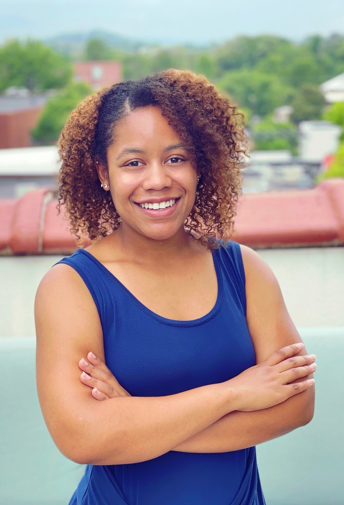
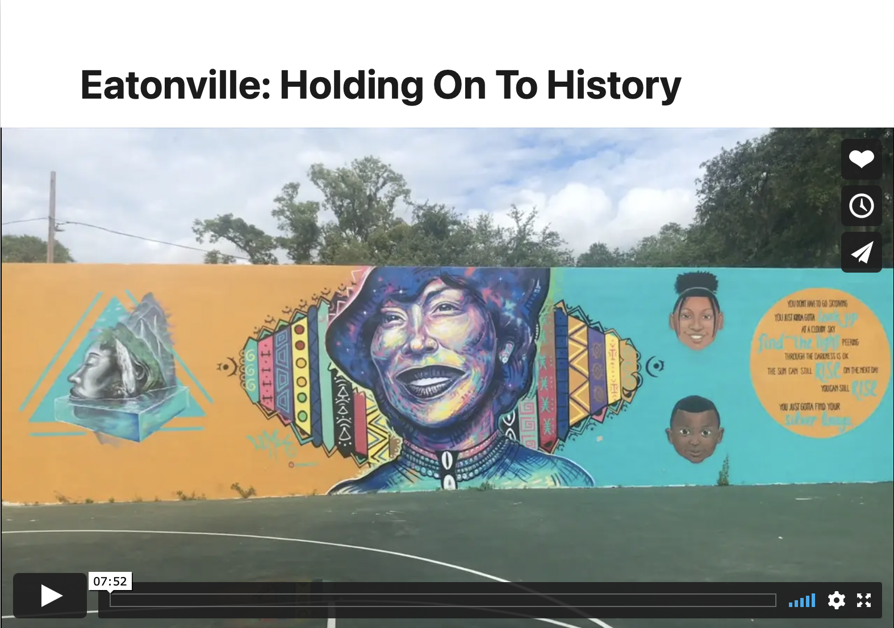

My name is Allison Mitchell, I am a PhD candidate in the Corcoran History Department at the University of Virginia where I study 20th century Black political history and civil rights studies. My current work looks at Black Floridians grassroots organizing efforts throughout the 20th century as the develop their own ideas of political power and combat voter suppression. I seek understanding to what extent is the vote suppression and what is mean to be politically engaged beyond just casting a ballot. Moreover, I push us to rethink the functionality of American democracy.

**Charolettesville, Virginia.**
 
## Coursework

## Related Writing 

## Film Project

**Eationville: Holding On To History** 
Just outside Orlando and nestled between Winter Park and Maitland lies Eatonville, Florida, the first known all-Black incorporated municipality in the United States. The town was founded on August 15, 1887 by 27 Black men, who, as a requirement, were all registered voters. At one hundred and thirty-three years old, Eatonville remains a thriving community that cherishes its heritage. It is also a community that is wrestling with the ever-changing landscape and culture surrounding them. Eatonville: Holding on to History is centered upon the reflections of current community members. They recall their history, discuss the town’s changing landscape and culture, and share their hopes for the future. Viewers will hear the thoughts of Louise Franklin, Clarise Hopkins, Rose Bynum, Andra Bynum Thomas, and James Benderson. Collectively, they represent the multifaceted Black community that is committed to ensuring prosperity in their town.
